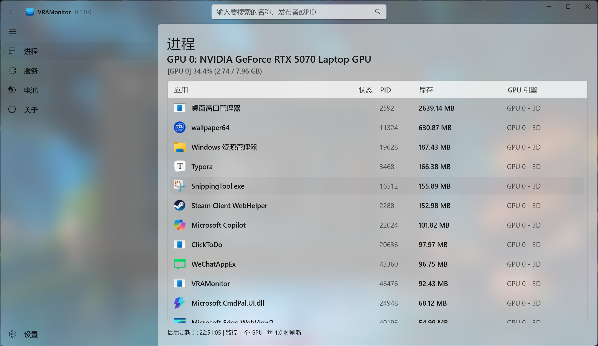
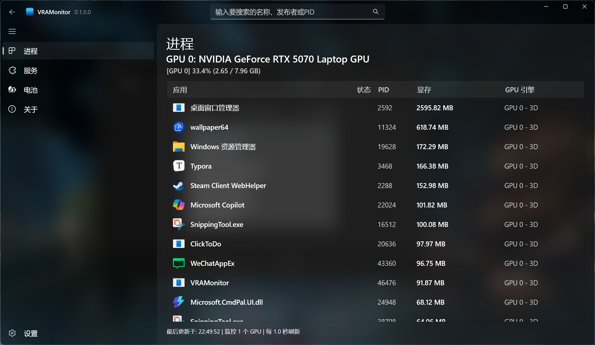

<div align=center>
  
</div>

<div align=center>
  
</div>

<h2 align="center">
VRAMonitor
</h2>

<div align="center">
💖 一款可以查看每个应用显存使用量的应用，基于 WinUI3 构建 😎
</div>
<div align="center">
由 POINTER 用 ❤️ 制作
</div>

<div align="center">

[中文 README](README.md) | [English README](README_en.md)

</div>

<div align=center>

[](https://deepwiki.com/)
[![zread](https://img.shields.io/badge/Ask_Zread-_.svg?style=flat&color=00b0aa&labelColor=000000&logo=data%3Aimage%2Fsvg%2Bxml%3Bbase64%2CPHN2ZyB3aWR0aD0iMTYiIGhlaWdodD0iMTYiIHZpZXdCb3g9IjAgMCAxNiAxNiIgZmlsbD0ibm9uZSIgeG1sbnM9Imh0dHA6Ly93d3cudzMub3JnLzIwMDAvc3ZnIj4KPHBhdGggZD0iTTQuOTYxNTYgMS42MDAxSDIuMjQxNTZDMS44ODgxIDEuNjAwMSAxLjYwMTU2IDEuODg2NjQgMS42MDE1NiAyLjI0MDFWNC45NjAxQzEuNjAxNTYgNS4zMTM1NiAxLjg4ODEgNS42MDAxIDIuMjQxNTYgNS42MDAxSDQuOTYxNTZDNS4zMTUwMiA1LjYwMDEgNS42MDE1NiA1LjMxMzU2IDUuNjAxNTYgNC45NjAxVjIuMjQwMUM1LjYwMTU2IDEuODg2NjQgNS4zMTUwMiAxLjYwMDEgNC45NjE1NiAxLjYwMDFaIiBmaWxsPSIjZmZmIi8%2BCjxwYXRoIGQ9Ik00Ljk2MTU2IDEwLjM5OTlIMi4yNDE1NkMxLjg4ODEgMTAuMzk5OSAxLjYwMTU2IDEwLjY4NjQgMS42MDE1NiAxMS4wMzk5VjEzLjc1OTlDMS42MDE1NiAxNC4xMTM0IDEuODg4MSAxNC4zOTk5IDIuMjQxNTYgMTQuMzk5OUg0Ljk2MTU2QzUuMzE1MDIgMTQuMzk5OSA1LjYwMTU2IDE0LjExMzQgNS42MDE1NiAxMy43NTk5VjExLjAzOTlDNS42MDE1NiAxMC42ODY0IDUuMzE1MDIgMTAuMzk5OSA0Ljk2MTU2IDEwLjM5OTlaIiBmaWxsPSIjZmZmIi8%2BCjxwYXRoIGQ9Ik0xMy43NTg0IDEuNjAwMUgxMS4wMzg0QzEwLjY4NSAxLjYwMDEgMTAuMzk4NCAxLjg4NjY0IDEwLjM5ODQgMi4yNDAxVjQuOTYwMUMxMC4zOTg0IDUuMzEzNTYgMTAuNjg1IDUuNjAwMSAxMS4wMzg0IDUuNjAwMUgxMy43NTg0QzE0LjExMTkgNS42MDAxIDE0LjM5ODQgNS4zMTM1NiAxNC4zOTg0IDQuOTYwMVYyLjI0MDFDMTQuMzk4NCAxLjg4NjY0IDE0LjExMTkgMS42MDAxIDEzLjc1ODQgMS42MDAxWiIgZmlsbD0iI2ZmZiIvPgo8cGF0aCBkPSJNNCAxMkwxMiA0TDQgMTJaIiBmaWxsPSIjZmZmIi8%2BCjxwYXRoIGQ9Ik00IDEyTDEyIDQiIHN0cm9rZT0iI2ZmZiIgc3Ryb2tlLXdpZHRoPSIxLjUiIHN0cm9rZS1saW5lY2FwPSJyb3VuZCIvPgo8L3N2Zz4K&logoColor=ffffff)](https://zread.ai/)

</div>


------

## 反馈和社群

反馈：GitHub Issues

社群：暂无


## 主要功能

- 进程管理
  - 查看每个应用的具体显存使用量
  - 结束进程
  - 把进程设置为效能模式
  - 查看进程属性
- 服务管理
- 电池管理
- 软件设置
  - 通用
  - 主题
    - 多种窗口材质
    - 多种主窗口样式
    - 多种字体
    
  - 快捷键
  - 导出用户设置


## 屏幕截图







## 更新路线

- 修复部分bug
- 制作看板页面
- 兼容 AMD GPU (使用ADLX)
- 兼容 Intel GPU (使用Intel(R) Metrics Discovery API)
- 兼容 Moore Threads GPU (使用WDDM)


## 已知问题和注意事项

已知问题：GitHub Issues

注意事项：

- 本项目虽然使用了 MVVM，但是并未使用 Dependency Injection

- 以下主题暂不支持浅色模式或者支持较差
  - Blur
  - None
- 托盘菜单在第一次显示时，长度过短可能会遮住部分字，此为第三方库的问题
- 标注为 “**LAB**” 的选项可能不稳定，可能会造成意想不到的后果


## 即刻体验

**最低系统要求:**

Windows 10, version 1903 (10.0.18362.0)

.NET Desktop Runtime 10 | [下载 .NET 10.0 (Linux、macOS 和 Windows) | .NET](https://dotnet.microsoft.com/download/dotnet/10.0)

**下载：**

| GitHub | [Releases](https://github.com/jin6yang/VRAMonitor/releases) |
| ------ | ----------------------------------------------------------- |

**安装：**

> **注意！**在导入安全证书时，要选择存储位置为”**本地计算机**“，选择证书存储时，需要选择“**将所有的证书都放入下列存储**”，然后点击**浏览**，选择“**受信任的根证书颁发机构**”，按向导完成证书导入后，打开 `.msixbundle` 安装包即可安装应用。

[旁加载第三方应用 | Microsoft Learn](https://learn.microsoft.com/windows/application-management/sideload-apps-in-windows)

**如何删除证书?**

1. 	按 **Win + R** 打开运行框
2. 	输入：

```
certmgr.msc
```

3. 选择 **受信任的根证书颁发机构 → 证书**
4. 找到颁发者为 **POINTER** 的证书
5. 右键 → **删除**


## 自己构建

1. 打开 Visual Studio 2026
   （确保拥有 “WinUI 应用程序开发” 工作负荷 和 “.NET 10.0 运行时” 单个组件）
2. 打开项目文件 `VRAMonitor.sln`
3. 右键解决方案，选择“还原 NuGet 包”
4. 再次右键解决方案，选择“重新生成解决方案”
5. 右键 `VRAMonitor (Packeage)`, 选择”发布-创建应用程序包“
6. 按引导完成创建 MSIX安装包


## 许可证


## 贡献

[jin6yang (POINTER)](https://github.com/jin6yang)


## 感谢

查看所有依赖：[GitHub Insights Dependencies · jin6yang/VRAMonitor](https://github.com/jin6yang/VRAMonitor/network/dependencies)
